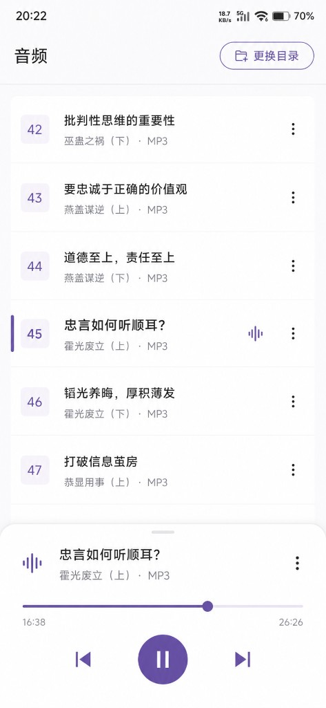
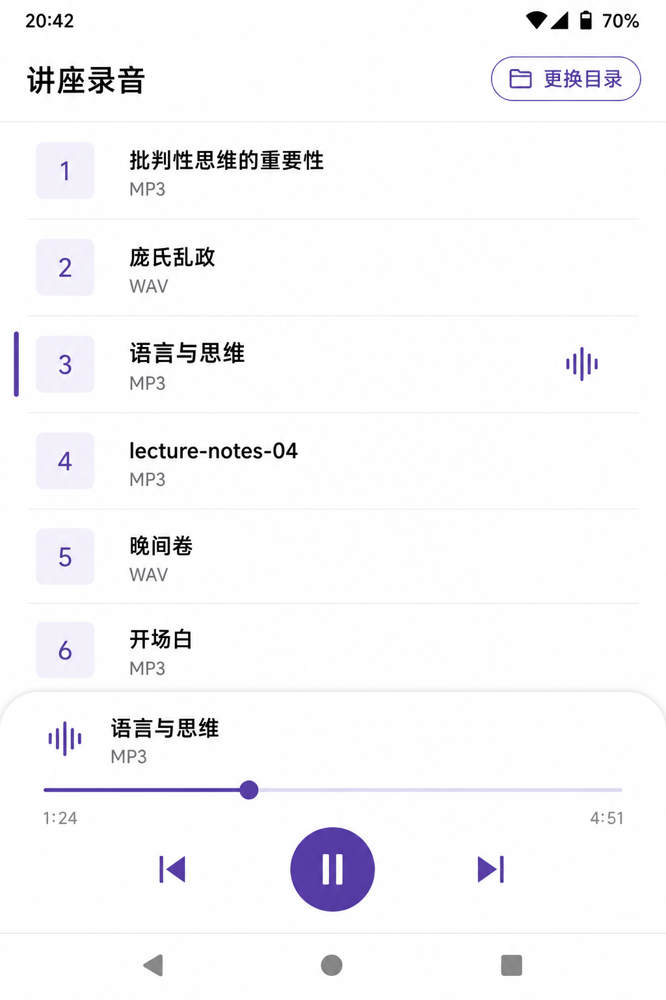
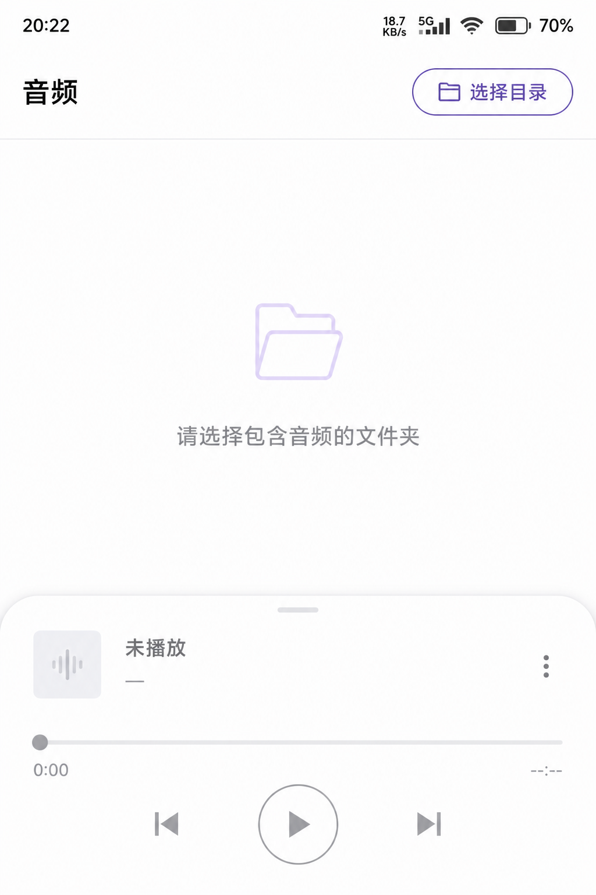
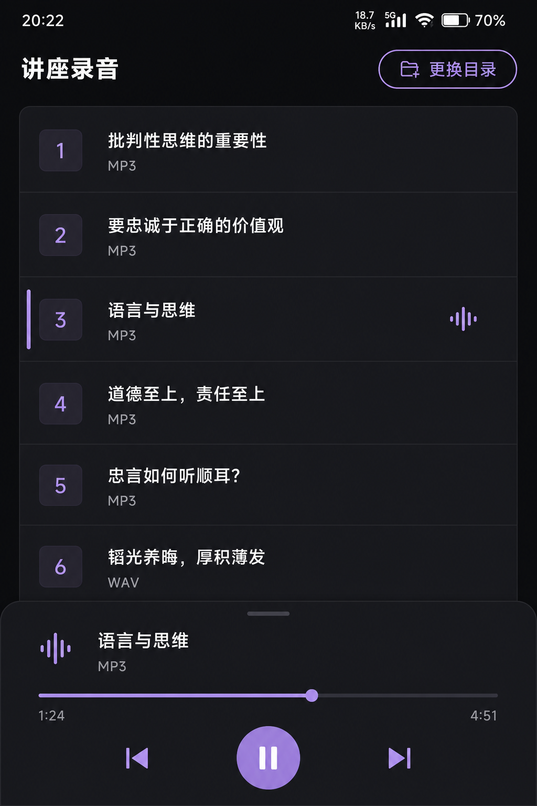

# ecaijw 播放器 UI 设计方案

状态：v1 视觉规范。功能范围以《技术方案》为准，本文只定界面。

风格参考：浅色 Material 3、柔和紫强调、序号列表、底部悬浮播放卡。参考图见 `ui/style-reference.png`。v1 只借用视觉语言，不增加参考图里没有产品依据的功能（三点菜单、歌手/专辑、均衡器动画）。

---

## 1. 设计目标

本地播放器的使用者是「选一个文件夹，点文件名就听」。界面只服务这件事：

- 一眼看到当前目录和当前曲
- 列表好扫：序号、主标题、格式，字够大、行距够
- 底部播放卡永远固定，不随列表滚动
- 当前曲用左侧紫条 + 波形标记，不用整行深色铺底

明确不做：音量条、循环/随机、歌词、封面、搜索、歌单、刷新、设置页、启动闪屏、行内三点菜单。

---

## 2. 信息架构：单屏三区

竖屏优先。系统状态栏、导航栏各自留出安全区。不强制横屏。

```
┌─────────────────────────────────────┐
│  状态栏（系统）                       │
├─────────────────────────────────────┤
│  A 顶栏                              │
│  讲座录音              [📁 更换目录]  │
├─────────────────────────────────────┤
│  B 曲库（可滚动）                     │
│  ┃ [ 3 ]  语言与思维          ♪     │
│          MP3                        │
│  ─ ─ ─ ─ ─ ─ ─ ─ ─ ─ ─ ─ ─ ─ ─    │
│    [ 4 ]  lecture-notes-04          │
│          MP3                        │
├─────────────────────────────────────┤
│  C 底部播放卡（圆角上沿，浮起）       │
│    ♪  语言与思维                     │
│       MP3                           │
│         ────────●────────           │
│         1:24              4:51      │
│         ⏮        ⏸        ⏭        │
├─────────────────────────────────────┤
│  导航栏（系统）                       │
└─────────────────────────────────────┘
```

| 区域 | 内容 | 行为 |
|---|---|---|
| A 顶栏 | 左侧大标题；右侧描边胶囊按钮 | 未选目录 / 权限丢失：标题为「音频」，按钮为「选择目录」。已选目录：标题为目录名，按钮为「更换目录」 |
| B 曲库 | 序号徽章 + 文件名（去扩展名）+ 格式行 | 点击立即从该曲开头播放；当前项滚进可视区 |
| C 播放卡 | 当前曲信息、进度、上一首 / 播放暂停 / 下一首 | 始终贴底；无曲目时整卡禁用、弱化 |

出错文案叠在列表底部、播放卡上方，一行小字，错误色。不弹全屏对话框。

---

## 3. 视觉规范

### 3.1 气质

白底、留白多、圆角大。强调色是柔和紫，不是科技蓝，也不是上一版的暖褐纸色。列表像一份干净的讲座目录；播放区是一张浮在底部的卡片。

跟随系统浅色 / 深色。v1 不做多套皮肤、不提供应用内切换。

### 3.2 色板

浅色（主参考，对齐参考图）：

| 角色 | Hex | 用途 |
|---|---|---|
| 背景 | `#FFFBFE` | 整屏底 |
| 表面 | `#FFFFFF` | 底部播放卡 |
| 主文字 | `#1C1B1F` | 标题、文件名 |
| 次要文字 | `#79747E` | 格式行、时间、空状态 |
| 强调 | `#6750A4` | 描边按钮、序号、进度、播放圆钮、当前曲左侧条 |
| 强调容器 | `#E8DEF8` | 序号徽章底、浅紫点缀 |
| 分割线 | `#E7E0EC` | 列表细线 |
| 错误 | 系统 `error` | 底栏上一行提示 |

深色（同一套强调，换表面）：

| 角色 | Hex | 用途 |
|---|---|---|
| 背景 | `#1C1B1F` | 整屏底 |
| 表面 | `#2B2930` | 底部播放卡 |
| 主文字 | `#E6E1E5` | 标题、文件名 |
| 次要文字 | `#CAC4D0` | 格式、时间 |
| 强调 | `#D0BCFF` | 按钮描边、序号、进度、图标 |
| 强调容器 | `#4A4458` | 序号徽章底 |
| 播放圆钮 | `#6750A4` | 中心实心钮，白图标 |

实现时写入 `ColorScheme`（`primary` = 强调紫）。不要在列表里散落 `Color(0xFF…)`。

### 3.3 字体与字号

系统默认字体，不加自定义字体文件。

| 元素 | 字号 | 字重 | 行数 |
|---|---|---|---|
| 顶栏标题 | 22sp | Bold | 1 行，超出省略 |
| 列表主标题 | 17sp | SemiBold / 当前曲 SemiBold | 1 行，超出省略 |
| 列表副行（格式） | 13sp | Regular，次要色 | 1 行 |
| 序号 | 14sp | Medium，强调色 | 居中 |
| 播放卡标题 | 16sp | SemiBold | 1 行省略 |
| 时间 | 12sp | Regular，次要色 | `m:ss`；未知 `--:--` |
| 空状态 | 16sp | Regular，次要色 | 居中 |

主标题用去扩展名后的 `displayName`。扩展名单独放到副行，大写：`MP3` / `WAV`。不要伪造歌手、专辑。

### 3.4 圆角与间距

| 项 | 值 |
|---|---|
| 序号徽章 | 12dp 圆角，约 44×44dp |
| 目录按钮 | 胶囊（高度一半的圆角），高 40dp |
| 播放卡上沿 | 28dp 圆角 |
| 播放圆钮 | 直径 56dp |
| 顶栏左右 | 20dp，上下 12dp |
| 列表左右 | 20dp |
| 列表项上下 | 12dp |
| 分割线左右 inset | 与文字列对齐（徽章右侧起） |
| 播放卡内边距 | 20dp |
| 进度条触控高度 | 44dp |

---

## 4. 组件细则

### 4.1 顶栏

左侧：大号加粗标题，不是小字目录名。

右侧：`OutlinedButton` 胶囊，文件夹图标 + 文案。未选目录时这是全屏主操作，描边和字都用强调紫，足够醒目。不要改成实心褐按钮。

- 文案：`选择目录` / `更换目录`
- 加载中标题显示「正在加载…」，按钮仍可点

### 4.2 列表行

从左到右：

1. 当前曲时，行最左侧一条 3dp 宽的强调色竖条（贴屏幕左缘）
2. 圆角方徽章，内为 1-based 序号（与列表顺序一致）
3. 两行文字：去扩展名文件名 + 格式
4. 仅当前曲在右侧显示静止波形图标（播放中与暂停在这首都显示）。v1 不做跳动动画

不要：三点菜单、封面、整行铺色、行内时长。

切歌或启动恢复时，把当前项滚进可视区。

### 4.3 底部播放卡

白色（深色模式为表面色）卡片，上沿大圆角，轻微阴影，贴齐系统导航栏上方。

- 第一行：波形图标 + 当前文件名 + 格式。无曲目时标题「未播放」
- 进度条：`duration` 已知才可拖；未知或无曲则禁用
- 拖动中时间跟随滑块；松手后再 seek；只改当前曲位置
- 控制：上一首图标、实心圆播放/暂停、下一首图标。图标需带无障碍说明「上一首 / 播放 / 暂停 / 下一首」
- 无曲目时整卡禁用（灰图标、不可拖）

播放中圆钮显示暂停条；暂停或播完显示三角播放。最后一首结束后再按播放：从该曲开头重播（产品规则，界面不另解释）。

上一首：已播超过 3 秒则先回到开头，否则切上一首。界面不展示这条规则。

---

## 5. 界面状态

| 状态 | 顶栏左侧 | 列表区 | 播放卡 |
|---|---|---|---|
| 未选目录 | 音频 | 「请选择包含音频的文件夹」 | 禁用，标题「未播放」 |
| 权限丢失 | 音频 | 「无法访问上次的目录，请重新选择」 | 禁用 |
| 加载中 | 正在加载… | 居中圆形进度 | 保持上次，若无曲则禁用 |
| 已加载、无音频 | 目录名 | 「该目录没有 mp3 或 wav 文件」 | 禁用 |
| 已加载、有音频 | 目录名 | 序号列表 | 可用 |
| 扫描/播放错误 | 视曲库而定 | 列表仍在则保留；播放卡上方一行错误 | 视是否有队列 |

无独立错误页。权限丢失时按钮改回「选择目录」。

---

## 6. 设计图

风格参考（用户指定的视觉方向；落地时去掉三点菜单和专辑行）：



浅色 · 播放中：紫描边「更换目录」、序号徽章、当前曲左条 + 波形、底部圆角播放卡与圆形暂停钮。



浅色 · 未选目录：标题「音频」，主操作是「选择目录」；播放卡保留但禁用。



深色 · 播放中：同一结构，深表面 + 浅紫强调。



---

## 7. 交互与动效

v1 只接受：

- 列表滚到当前曲：`animateScrollToItem`
- 进度条随播放更新（200–500ms 读一次位置）
- 按钮按下使用系统涟漪

不要：封面旋转、波形跳动、主题色随曲目变化、切歌翻页。

系统媒体通知跟系统样式。通知小图标用应用状态栏图标；点通知回到本 App 播放页（`singleTop`）。

---

## 8. 无障碍与触控

- 运输控件是图标，必须写 `contentDescription`
- 列表行、进度条、三个控制按钮触控高度 ≥ 44dp
- 文件名 1 行省略，避免把相邻行挤没
- 跟随系统深色模式和字体缩放

---

## 9. 与实现的对应

| 规范 | 代码位置 |
|---|---|
| 单屏三区 | `PlayerScreen.kt` |
| 顶栏大标题 + 描边胶囊 | `DirectoryHeader` |
| 序号徽章、双行文字、当前曲左条 | `TrackList` |
| 圆角播放卡 + 圆形播放钮 | `PlaybackControls` |
| 空状态文案 | `EmptyHint` + `LibraryState` |
| 主题紫 | `ui/theme/Theme.kt` 的 `ColorScheme` |

落地检查：

1. 未选目录时，「选择目录」是紫色描边胶囊，带文件夹图标
2. 当前曲不是蓝底整行，也不是暖褐整行，而是左紫条 + 波形
3. 列表副行只有 `MP3`/`WAV`，没有编造的歌手名
4. 没有三点菜单
5. 浅色 / 深色各走一遍：选目录 → 点播 → 暂停 → 拖进度 → 上一首 / 下一首
